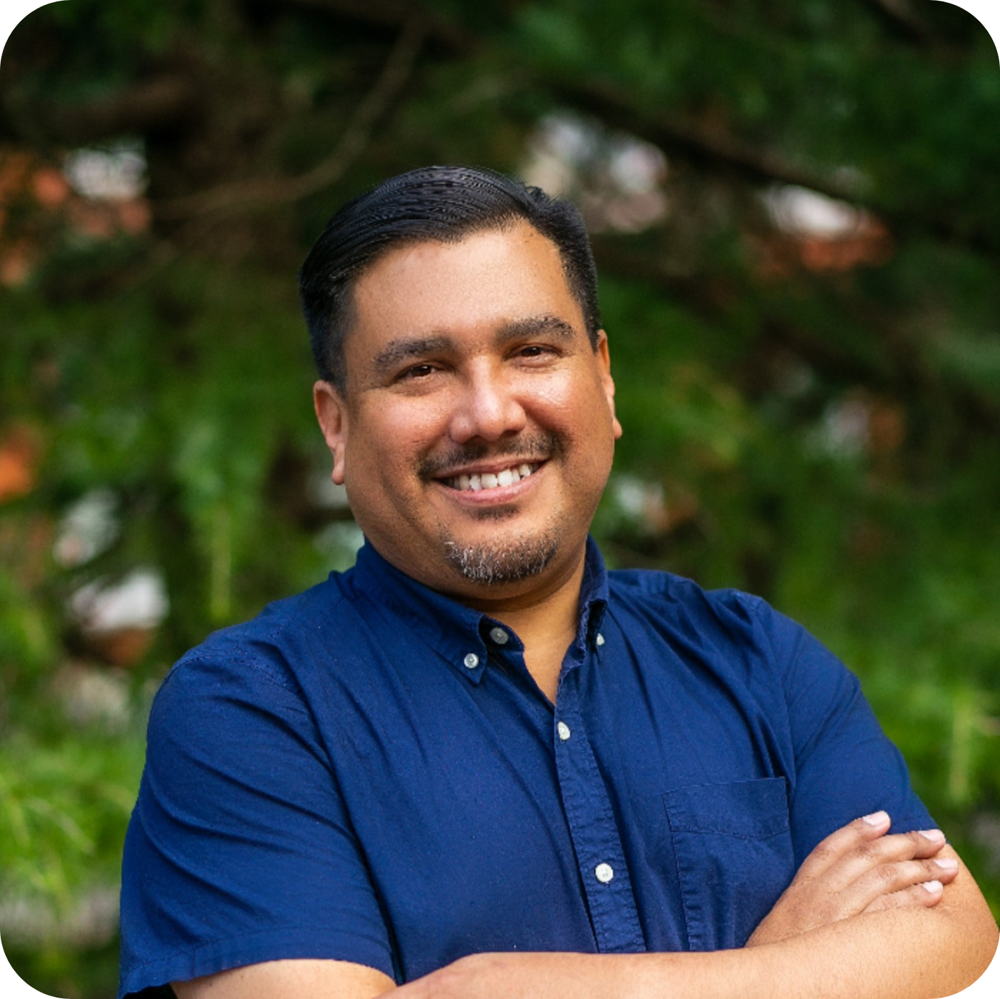

## Ken Montenegro  
### Technologist, Lawyer, Factotum
Ken Montenegro (he/him/el) is a technologist with over 25 years working with mission-driven organizations, groups, and formations. He deeply believes in people power and the dymistification of systems. Ken is the past senior technologist at the Center for Constitutional Rights, Advancing Justice Los Angeles, Homeless Healthcare Los Angeles, the Coalition for Humane Immigrant Rights of Los Angeles, and Maternal and Child Health Access. He also provides limited-scope consulting with a focus on digital transformation and holistic security.  

Ken was born and raised in Los Angeles, has a law degree from Peoples College of Law, and is a co-founder of the Stop LAPD Spying Coalition. He has served on the boards of May First Movement Techology, the Immigrant Defenders Law Center, NTEN, 1st Unitarian Church of Los Angeles, National Lawyers Guild of Los Angeles, as well as the National Lawyers Guild national board. 

Ken is a founding member of the Progressive Security Alliance and is a proud collaborator of the Vision, Change, Win National Community Safety and Security School. Ken has been a speaker at various venues on issues such as digital security, fighting online fascism, and resisting surveillance/state violence.  

Ken has done human rights and election protection work in numerous Latin American countries (Abya Yala) and the United States (Turtle Island). He currently lives in Queens, New York.  
  
